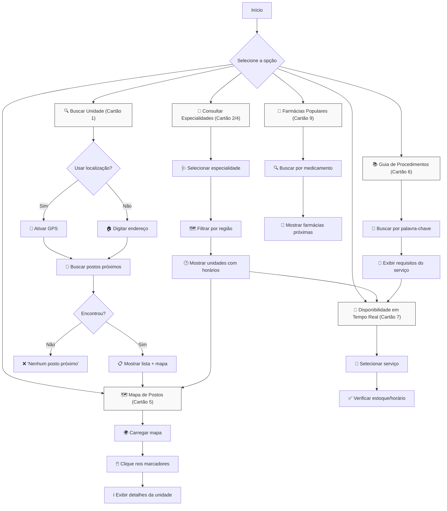

#viva-saude

O Viva Saúde é uma solução desenvolvida para otimizar o acesso da população a informações e serviços de saúde, minimizando deslocamentos desnecessários, filas e dificuldades na obtenção de atendimentos.

## Funcionalidades Principais

### 1. Buscar Unidade de Atendimento
 Consulta sobre quais unidades de saúde estão perto de sua localização.
 Evita deslocamentos desnecessários e perda de tempo.

### 2. Consulta de Especialidades
 Permite que o usuário busque postos de saúde com base em uma especialidade específica, como pediatria.

### 3. Especialidades médicas disponíveis
 Permite que o usuário veja de uma maneira mais ampla as funcionalidades presentes nas UPAs

### 4. Encontre o serviço de saúde ideal
 Ter botões ou outras funcionalidades chamativas que levem o usuário a sanar suas dúvidas.

### 5. Localização de Postos por Região
 Permite que o usuário visualize os postos de saúde em um mapa, filtrando por regiões ou bairros.

### 6. Guia de Procedimentos
 Disponibiliza para o usuário um guia simples e direto com os principais serviços que os postos de saúde oferecem.

### 7. Avaliação do Atendimento
 Permite que o usuário avalie o atendimento do posto.

### 8. Dicas de Saúde
 Permite ao usuário acessar informações gerais sobre saúde preventiva para evitar consultas desnecessárias e melhorar seu bem-estar.

### 9. Direcionamento para Farmácias Populares
 Permite que o usuário encontre farmácias populares próximas onde possa adquirir medicamentos de forma acessível.

### 10. Lista de Documentos Necessários
 Permite que o usuário saiba quais documentos são exigidos para cada tipo de atendimento nos postos de saúde para evitar problemas na hora do atendimento.

## Tecnologias Utilizadas
  **Geolocalização**: Identificação de unidades próxima
  
  **Banco de Dados**: Armazenamento de informações
  
  **Interface Acessível**: Usabilidade para todos os públicos

## Público-Alvo
   Trabalhadores com rotinas apertadas
   Idosos e pessoas com dificuldades de locomoção
   Pais preocupados com saúde infantil
   Usuários com pouca familiaridade tecnológica

## Screencast
   Acesse o vídeo por esse link : https://youtu.be/DGZ97a13bkc?si=l23V6P_hzwcB1wMq

## Backlog
 

## Storyboard 1 - Tela de pesquisa de posto (História 1)
 

## Storyboard 2 - Tela de geolocalização (História 5)
 

## Storyboard 3 -  Tela de atendimento especializado (História 2)
 

## Storyboard 4 - Tela de informações sobre funcionamento (História 3)
 

## Storyboard 5 - Tela de especialidades mais requisitadas pela população (História 6)
 

## Issue / Bug tracker (No code)
 

## Programação em par
 Durante parte do nosso projeto, deixamos de lado a ideia de usar programação em par, mas depois percebemos que seria um desperdício de conhecimento e talento se descartássemos essa técnica de desenvolvimento. Nossa equipe não ficou separada em duplas específicas, mas   sim por quem tinha mais disponibilidade para se juntar, tanto pessoalmente quanto online.

 No início, nos reuníamos antes das aulas para nos ajudarmos uns aos outros, sanar dúvidas sobre o código e corrigir erros. Depois, começamos a nos juntar no Discord quase todos os dias para "codar" usando a técnica de programação em par. Todos os integrantes da equipe  participaram dessa troca de conhecimento e talento, fortalecendo nossa equipe não só individualmente, mas também coletivamente.
 

## Equipe
 
 

## Site em construção da Viva Saúde (Clique na imagem para entrar no Screencast do entregável 2)
 
 Acesse por esse link : https://viva-saude-nine.vercel.app/

## Quadro Trello Viva Saúde
 

## DIAGRAMA DE ATIVIDADES

# Diagrama de Atividades - Viva Saúde

**Legenda:**  
🔍 Busca | 📍 GPS | 🏠 Endereço | 🏥 Saúde | 🕒 Horários | 💉 Vacinas | 💊 Medicamentos  
